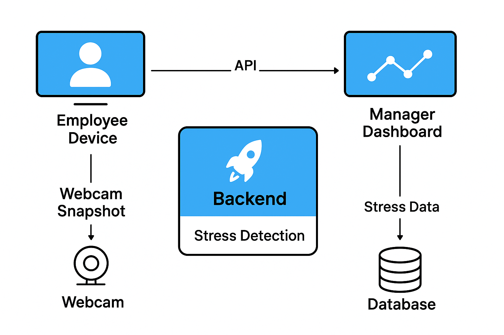
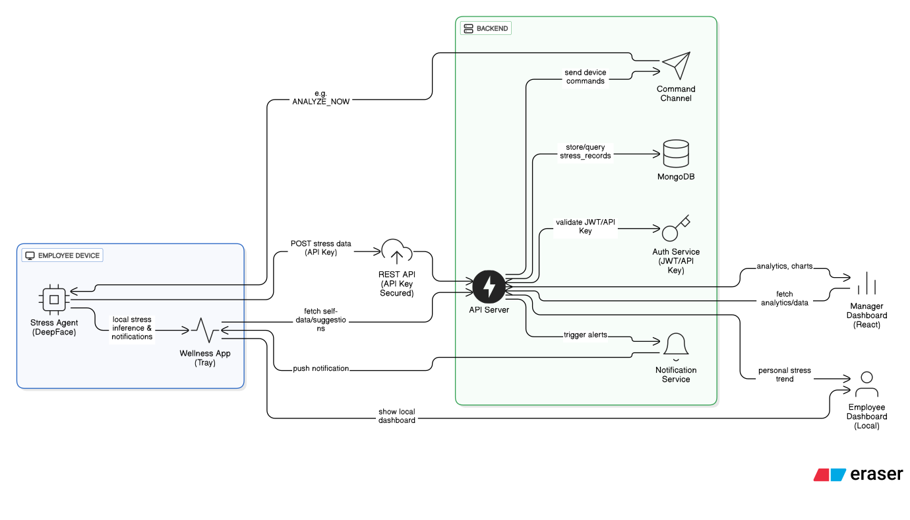

# StressSense Manager Dashboard

A modern React-based dashboard for managers to monitor employee stress levels and analytics in real-time.

## System Architecture

### Simple Architecture Overview


### Detailed System Architecture


## Features

- Real-time employee stress monitoring
- Interactive analytics dashboard
- Employee management interface
- Stress trend visualization
- Secure authentication
- Responsive design with Tailwind CSS

## Tech Stack

- React 19
- React Router for navigation
- Axios for API communication
- Tailwind CSS for styling
- Recharts for data visualization
- JWT for authentication

## Getting Started

### Prerequisites

- Node.js 16+
- npm or yarn
- Backend API running (see backend README)

### Installation

1. Install dependencies:
```bash
npm install
```

2. Start the development server:
```bash
npm start
```

The dashboard will be available at `http://localhost:3000`

### Build for Production

```bash
npm run build
```

## Usage

1. Login with manager credentials (default: admin/adminpassword)
2. View real-time employee stress levels on the overview page
3. Access detailed analytics in the Analytics section
4. Manage employees and view individual stress histories

## API Integration

The dashboard communicates with the StressSense backend API. Make sure the backend is running and accessible.

## Contributing

1. Follow React best practices
2. Use Tailwind CSS for styling
3. Ensure responsive design
4. Test API integrations thoroughly
